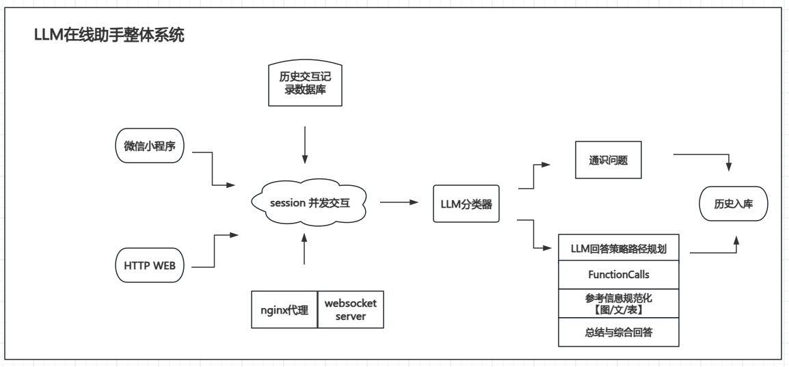

微信小程序体验二维码【牛仔AIGC开源工具】：

网站访问地址【牛仔财经大模型助手】：（推荐使用电脑）
http://297m5090w9.wicp.vip/ 

# 项目结构介绍
本LLM（Large Language Model，大型语言模型）整体系统是一个高度集成、模块化的智能问答系统，旨在通过高效的数据处理、精准的问题分类、灵活的答案生成策略以及可靠的通信代理，为用户提供高质量的、定制化的回答服务。以下是对系统中各个节点的详细介绍及它们之间联系的阐述。
本项目旨在创建以大模型为底座，借助prompt工程，多流程Agent，结合各个角色定义，推理过程考虑CoT，以及大模型微调等方式构建的股票余财经咨询助手。
项目提供微信小程序体验版以及网页版为前端。
+ 欢迎star，
+ 欢迎分享
+ 欢迎提技术issue到： https://github.com/leoluopy/llm_stock_chat_niuzai
+ 联系作者v信： leoluopy

## 节点介绍

### HTTP WEB
功能介绍：HTTP WEB模块提供了系统与外部世界的接口，允许通过HTTP协议接收用户请求并返回回答。这使得系统能够轻松集成到各种Web应用中，扩展其应用场景和覆盖范围。

### 微信小程序
功能介绍：微信小程序作为用户与系统交互的前端界面，提供了友好的用户界面和便捷的交互方式。用户可以通过小程序输入问题、查看回答、浏览历史记录等，实现与LLM系统的无缝对接。

### session 并发交互
功能介绍：该模块负责处理多个用户同时与系统交互的情况，确保每个用户的请求都能得到及时、准确的响应。通过并发控制机制，系统能够高效管理用户会话，提升整体处理能力和用户体验。

### nginx 代理 websocket server代理
功能介绍：nginx作为高性能的HTTP和反向代理服务器，负责处理用户请求的转发和负载均衡。同时，websocket server代理模块支持实时双向通信，使得用户能够实时接收系统更新和回答，提升交互体验。

### 历史交互记录数据库
功能介绍：该数据库负责存储用户与系统之间的所有历史交互记录，包括但不限于用户提问、系统回答、时间戳、用户ID等关键信息。这些数据对于理解用户行为模式、优化回答策略、提升用户体验至关重要。

### LLM 分类器
功能介绍：LLM分类器负责将用户输入的问题进行分类，识别其所属的领域或类型。通过先进的自然语言处理技术，分类器能够准确理解用户意图，为后续的回答策略路径规划提供关键信息。

### 通识问题库
功能介绍：通识问题库存储了大量常见问题和对应的标准答案，这些问题通常涉及广泛的知识领域，如常识、科学、历史等。当用户提出的问题与库中问题匹配时，系统可以快速返回预定义的答案，提高回答速度和准确性。

### LLM回答策略路径规划
功能介绍：基于LLM分类器的分类结果，回答策略路径规划模块负责选择最合适的回答策略。这可能涉及从通识问题库中检索答案、调用外部API获取数据、使用大型语言模型生成回答等多种方式。

### FunctionCalls
功能介绍：FunctionCalls模块是系统内部的一个函数库，包含了执行各种任务所需的函数，如数据检索、文本处理、逻辑推理等。这些函数为回答策略路径规划模块提供了强大的支持，确保了系统能够灵活应对各种复杂问题。

### 参考信息规范化【文本/链接/图表】
功能介绍：该模块负责将系统生成或检索到的参考信息进行规范化处理，确保信息的准确性和一致性。这包括文本内容的清洗、链接的有效性验证以及图表的格式调整等。

### 总结与综合回答
功能介绍：在收集到所有必要的信息后，总结与综合回答模块负责将这些信息整合成一个清晰、连贯的回答。这一步骤确保了系统能够为用户提供高质量的、易于理解的回答。

### 历史入库
功能介绍：当用户与系统的交互结束时，历史入库模块负责将此次交互记录存储到历史交互记录数据库中。这一步骤确保了系统能够持续积累用户数据，为未来的分析和优化提供基础。

## 节点之间的联系
这些节点之间通过复杂而高效的交互机制紧密相连，共同构成了LLM系统的核心框架。具体来说：

+ 微信小程序作为用户接口，接收用户输入的问题，并将其发送给session并发交互模块进行处理。
+ session并发交互模块将问题传递给LLM分类器，后者对问题进行分类并确定回答策略。
+ 根据分类结果，LLM回答策略路径规划模块调用FunctionCalls中的相应函数，从通识问题库、历史交互记录数据库或外部API中检索信息。
+ 检索到的信息经过参考信息规范化模块的处理后，被传递给总结与综合回答模块进行整合。
+ 最终，整合后的回答通过nginx代理和websocket server代理返回给用户，同时历史入库模块将此次交互记录保存到数据库中。
+ 这一流程不仅确保了系统能够高效、准确地回答用户问题，还通过不断积累用户数据，为系统的持续优化和升级提供了有力支持。
